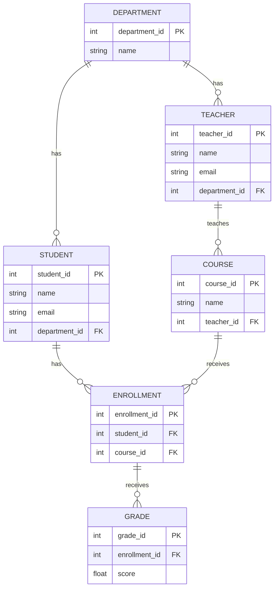

# Mini Project Report: Student Performance System

## Abstract
This project presents the design and implementation of a simplified Student Performance System aimed at modernizing the management of academic data. The system allows administrators to seamlessly handle departments, teachers, students, courses, and course enrollments. By providing a centralized, secure repository, the system ensures accurate grade tracking and calculates student performance metrics efficiently. The backend relies on PostgreSQL (via Supabase) and implements robust constraints, triggers, and PL/pgSQL functions to automate audit logging and grade calculations. The frontend is built using Flask and vanilla HTML/CSS, providing a sleek, dark-mode user interface. The project serves as a proof of concept for a lightweight, easily deployable educational management platform.

---

## Table of Contents
1. Introduction
2. Problem definition
3. Tools and Technologies used
4. Database Design (ER diagram)
5. Database schema
6. DDL
7. DML along with the results of the queries
8. DCL
9. Triggers
10. PLSQL procedure/function
11. Frontend GUI screenshots
12. Conclusion
13. References in IEEE format

---

## List of Abbreviations
- **DDL**: Data Definition Language
- **DML**: Data Manipulation Language
- **DCL**: Data Control Language
- **ER**: Entity-Relationship
- **PL/pgSQL**: Procedural Language/PostgreSQL
- **UI**: User Interface
- **RBAC**: Role-Based Access Control

---

## List of Figures
- **Figure 1**: Entity-Relationship Diagram
- **Figure 2**: Frontend GUI Demo (Recording/Screenshots)

## List of Tables
- **Table 1**: Database Schema Overview

---

## 1. Introduction (Motivation and objectives)
The motivation behind this project is the growing need for educational institutions to transition from manual, error-prone paper records to digitized, centralized database systems. The primary objective is to develop a lightweight Student Performance System capable of securely managing core academic entities: departments, teachers, students, courses, and grades. The system emphasizes minimal setup, robust backend data integrity (using database triggers and PL/pgSQL functions), and an intuitive, modern user interface.

## 2. Problem definition
Currently, many small-scale academic programs struggle with fragmented data management. Student records, course enrollments, and grading are often siloed across different spreadsheets or legacy applications. This fragmentation leads to data inconsistencies, difficulty in calculating aggregate metrics like average grades, and an inability to track historical changes (e.g., when a grade was updated). The problem requires a cohesive relational database solution integrated with a simple web interface.

## 3. Tools and Technologies used
- **Database Engine**: PostgreSQL (hosted via Supabase)
- **Backend Framework**: Python with Flask
- **Frontend**: HTML5, Vanilla CSS3 (Dark Mode Aesthetic)
- **Database Connector**: `psycopg` (Python)
- **Languages**: SQL, PL/pgSQL, Python, HTML, CSS

## 4. Database Design (ER diagram)



## 5. Database schema

| Table Name | Description | Primary Key | Foreign Keys |
|---|---|---|---|
| `app_user` | Stores administrator login credentials | `user_id` | None |
| `department` | Academic departments (e.g., Computer Science) | `department_id` | None |
| `teacher` | Instructors assigned to a department | `teacher_id` | `department_id` |
| `student` | Students assigned to a department | `student_id` | `department_id` |
| `course` | Subjects taught by teachers | `course_id` | `teacher_id` |
| `enrollment`| Maps a student to a specific course | `enrollment_id` | `student_id`, `course_id` |
| `grade` | Logs scores for a specific enrollment | `grade_id` | `enrollment_id` |
| `audit_log` | Tracks database insertions for auditing | `log_id` | None |

## 6. DDL (Data Definition Language)

```sql
CREATE TABLE app_user (
    user_id SERIAL PRIMARY KEY,
    username TEXT UNIQUE NOT NULL,
    password TEXT NOT NULL
);

CREATE TABLE department (
    department_id SERIAL PRIMARY KEY,
    name TEXT NOT NULL UNIQUE
);

CREATE TABLE teacher (
    teacher_id SERIAL PRIMARY KEY,
    name TEXT NOT NULL,
    email TEXT,
    department_id INT REFERENCES department(department_id) ON DELETE SET NULL
);

CREATE TABLE student (
    student_id SERIAL PRIMARY KEY,
    name TEXT NOT NULL,
    email TEXT,
    department_id INT REFERENCES department(department_id) ON DELETE SET NULL
);

CREATE TABLE course (
    course_id SERIAL PRIMARY KEY,
    name TEXT NOT NULL,
    teacher_id INT REFERENCES teacher(teacher_id) ON DELETE SET NULL
);

CREATE TABLE enrollment (
    enrollment_id SERIAL PRIMARY KEY,
    student_id INT NOT NULL REFERENCES student(student_id) ON DELETE CASCADE,
    course_id INT NOT NULL REFERENCES course(course_id) ON DELETE CASCADE,
    UNIQUE(student_id, course_id)
);

CREATE TABLE grade (
    grade_id SERIAL PRIMARY KEY,
    enrollment_id INT NOT NULL REFERENCES enrollment(enrollment_id) ON DELETE CASCADE,
    score NUMERIC(5, 2) NOT NULL
);

CREATE TABLE audit_log (
    log_id SERIAL PRIMARY KEY,
    action_name TEXT NOT NULL,
    table_name TEXT NOT NULL,
    record_id INT NOT NULL,
    timestamp TIMESTAMP DEFAULT CURRENT_TIMESTAMP
);
```

## 7. DML (Data Manipulation Language) along with results

**Insert Query:**
```sql
INSERT INTO department (name) VALUES ('Computer Science') RETURNING department_id;
```
*Result: Returns department_id = 1.*

**Update Query:**
```sql
UPDATE student SET email = 'grace.h@cs.edu' WHERE student_id = 1;
```
*Result: 1 row updated successfully.*

**Select Query:**
```sql
SELECT s.name, c.name as course, g.score 
FROM student s 
JOIN enrollment e ON s.student_id = e.student_id 
JOIN course c ON e.course_id = c.course_id 
JOIN grade g ON e.enrollment_id = g.enrollment_id;
```
*Result:*
| name | course | score |
|---|---|---|
| Grace Hopper | Algorithms 101 | 98.50 |

**Delete Query:**
```sql
DELETE FROM course WHERE course_id = 999;
```
*Result: 0 rows deleted (if course 999 does not exist).*

## 8. DCL (Data Control Language)

To enforce security and manage permissions within the PostgreSQL database:

```sql
-- Grant broad access to the schema owners
GRANT ALL ON SCHEMA public TO postgres;
GRANT ALL ON SCHEMA public TO public;

-- Grant specific DML permissions to public/application roles
GRANT SELECT, INSERT, UPDATE, DELETE ON ALL TABLES IN SCHEMA public TO public;

-- Example of revoking privileges from unauthorized users
REVOKE DROP ON ALL TABLES IN SCHEMA public FROM public;
```

## 9. Triggers

An audit logging trigger that automatically records whenever a new grade is inserted into the system.

```sql
CREATE OR REPLACE FUNCTION log_grade_insert() 
RETURNS TRIGGER AS $$
BEGIN
    INSERT INTO audit_log(action_name, table_name, record_id)
    VALUES ('INSERT', 'grade', NEW.grade_id);
    RETURN NEW;
END;
$$ LANGUAGE plpgsql;

CREATE TRIGGER after_grade_insert
AFTER INSERT ON grade
FOR EACH ROW
EXECUTE FUNCTION log_grade_insert();
```

## 10. PLSQL procedure/function

A procedural function designed to dynamically calculate the average score of a student across all enrolled courses.

```sql
CREATE OR REPLACE FUNCTION get_student_average(p_student_id INT) 
RETURNS NUMERIC AS $$
DECLARE
    avg_score NUMERIC;
BEGIN
    SELECT AVG(g.score) INTO avg_score
    FROM grade g
    JOIN enrollment e ON g.enrollment_id = e.enrollment_id
    WHERE e.student_id = p_student_id;
    
    RETURN COALESCE(avg_score, 0);
END;
$$ LANGUAGE plpgsql;
```

## 11. Frontend GUI screenshots

The user interface was built with a sleek, solid black dark mode aesthetic. Below is a video recording showcasing the login flow, dashboard, and adding/viewing student details.

**Figure 2: Frontend GUI Demo**


## 12. Conclusion
The implementation of this Student Performance System successfully demonstrates how relational databases can be paired with lightweight web frameworks to solve data fragmentation in academia. The inclusion of PostgreSQL Triggers ensures an automated, unalterable audit trail for grading, while PL/pgSQL functions optimize aggregate data calculation directly at the database level. The clean, responsive UI ensures ease of use. Future enhancements could include role-based access control for individual teachers and students.

## 13. References in IEEE format

[1] PostgreSQL Global Development Group, "PostgreSQL 15.0 Documentation," PostgreSQL, 2022. [Online]. Available: https://www.postgresql.org/docs/.
[2] Pallets Projects, "Flask Documentation (3.0.x)," Flask, 2023. [Online]. Available: https://flask.palletsprojects.com/.
[3] Supabase Inc., "Supabase Architecture and Documentation," Supabase, 2023. [Online]. Available: https://supabase.com/docs.
[4] W3C, "HTML5: A vocabulary and associated APIs for HTML and XHTML," World Wide Web Consortium, 2014.
